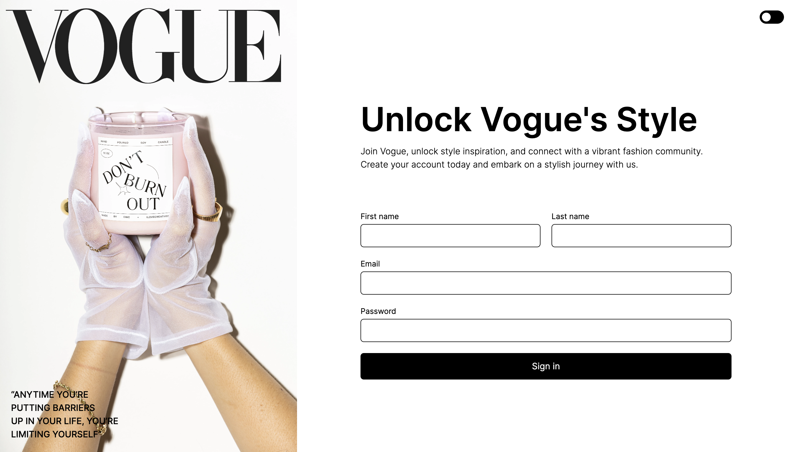
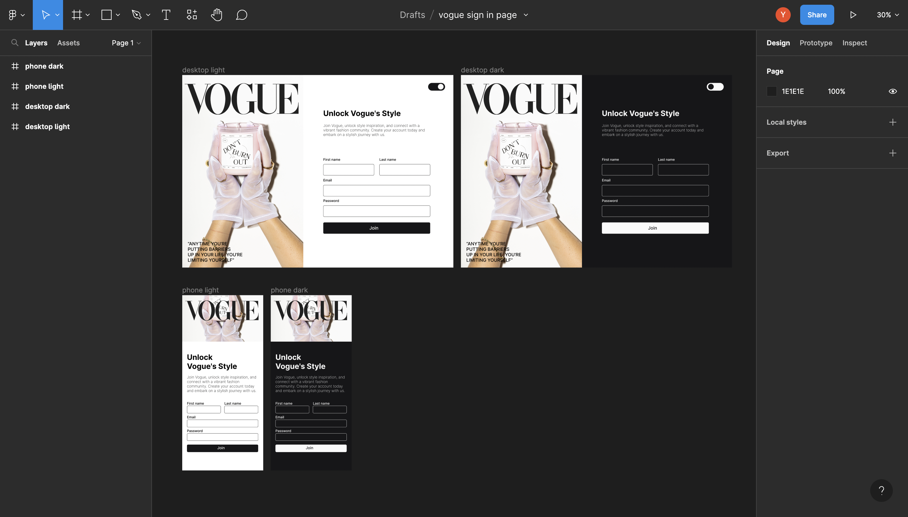

# Vogue Sign-in

[Live Demo](https://yusei07.github.io/vogue-sign-in/)

This project is a sign-in page for Vogue, a popular fashion magazine. Essentially, this project serves as a practice in getting myself
familiar with Tailwind CSS.

### Features
- Input fields for providing first name, last name, email, and password.
- Email validation check, to ensure email entered is valid.
- Support dark/light mode.
- Stylish design with a responsive layout for various screen sizes.

## UI/UX Design

[Figma Link](https://www.figma.com/file/rMm7hAqBcLd7ht07pk30v7/vogue-sign-in-page?type=design&node-id=0%3A1&t=uJ5S913H9WTYmdBg-1)

- Prototype design is inspired by Vogue's magazine's design and style. 
- Integration with Vogue's branding elements, including the logo, color scheme, font and text quote.

## Creds
- [Unplash](https://unsplash.com/) - cover image
